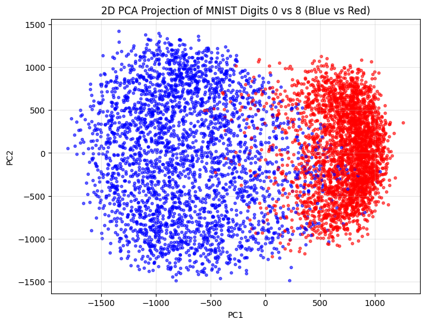
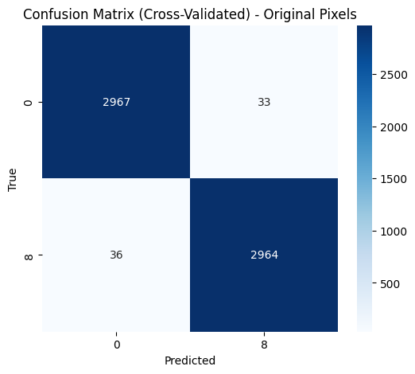
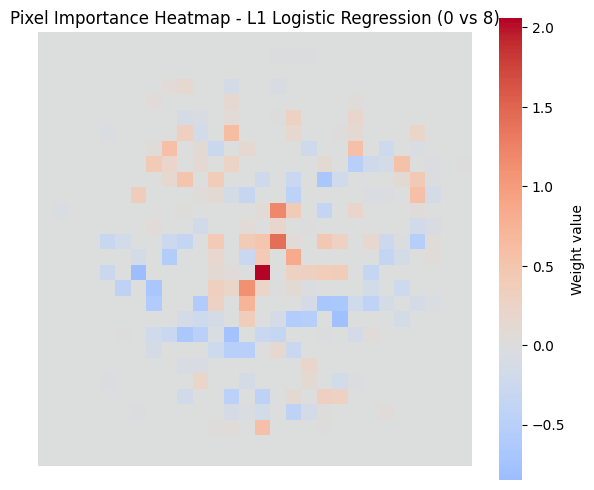

# MNIST L1 Logistic Regression (0 vs 8)

This project demonstrates binary classification of handwritten digits from the **MNIST dataset** using **L1-regularized Logistic Regression**.  
The task focuses on distinguishing **digits 0 and 8**, while analyzing how **sparsity, dimensionality reduction (PCA), and model interpretability** affect classification performance.

The project also compares two feature representations:

- **Original pixel space (784 features)**
- **PCA-transformed feature space**

Performance is evaluated using **5-fold cross-validation**, along with runtime comparison and model interpretability analysis.

---

# Project Structure
```bash
L1-Logistic-Regression-with-MNIST-dataset/
├── main.ipynb
├── README.md
└── requirements.txt
```

---

# Dataset

The project uses the **MNIST dataset (`mnist_784`)** from OpenML:

https://www.openml.org/d/554

- 70,000 grayscale images
- image size: 28 × 28 pixels
- flattened into 784-dimensional feature vectors

For this experiment, only **digits 0 and 8** are used.

To create a balanced dataset:

- 3,000 samples of digit **0**
- 3,000 samples of digit **8**

Total dataset size used:
6000 samples × 784 features


---

# Methodology

The workflow consists of the following stages:
```bash
1. Data preprocessing
2. Exploratory visualization (2D PCA)
3. Cross-validation model training
4. Comparison of original vs PCA features
5. Model evaluation (confusion matrix & metrics)
6. Model interpretability (sparsity & pixel importance heatmap)
```

---

# PCA Visualization

Principal Component Analysis (PCA) is used to project the high-dimensional image space into 2 dimensions for visualization.

The first two principal components explain ~28% of total variation. 
The scatter plot reveals partial separation between digits **0** and **8**, suggesting that the classification problem is **approximately linearly separable**, though some overlap occurs due to handwriting variability.

Note that 2D PCA is used only for visualization, not for training the final classifier.



---

# Model: L1-Regularized Logistic Regression

The classifier is implemented using:
```bash
sklearn.linear_model.LogisticRegression
```

Configuration:

- penalty: **L1 (Lasso)**
- solver: **liblinear**
- max_iter: **10000**

L1 regularization introduces **sparsity**, meaning many pixel weights become zero.  
This acts as automatic feature selection, retaining only the most informative pixels.

Final model sparsity:
195 non-zero weights out of 784 pixels
~ 25% relevant features

---

# Model Comparison

Two feature representations were evaluated using 5-fold cross-validation:

| Model | Mean Accuracy | Mean Precision | Mean Recall | Mean F1 | Mean Fit Time |
|------|------|------|------|------|------|
| Original Pixels + L1 Logistic | **0.9885** | 0.9885 | 0.9885 | 0.9885 | **0.33 s** |
| PCA + L1 Logistic | 0.9877 | 0.9877 | 0.9877 | 0.9877 | 0.74 s |

### Observations

- The original pixel representation slightly outperforms the PCA model in classification accuracy.
- Training on PCA features requires roughly twice the fitting time due to the additional dimensionality reduction step.
- Because the L1-regularized model already performs implicit feature selection, PCA does not provide a performance benefit in this task.

---

# Confusion Matrix Analysis

### Original Pixel Model

Across 6000 samples evaluated through cross-validation:

- 5931 correct predictions
- 69 misclassifications
- Overall accuracy: **98.85%**

Errors are nearly symmetric:

- 33 zeros misclassified as **8**
- 36 eights misclassified as **0**

Most misclassifications correspond to ambiguous handwritten digits where:

- elongated **0s** resemble **8s**
- simplified **8s** resemble **0s**



---

### PCA Feature Model

The PCA-based model produces 74 misclassifications out of 6000 samples yielding an accuracy of **98.77%**.

Errors remain balanced between classes:

- 35 zeros misclassified as **8**
- 39 eights misclassified as **0**

This slight increase in errors reflects the information loss introduced by dimensionality reduction even though the model remains highly accurate.


---

# Model Interpretability: Pixel Importance Heatmap

To understand which pixels influence the classifier, the learned weight vector was reshaped into a 28 × 28 heatmap

Key observations:

- Positive weights (red regions) push predictions toward digit **8**
- Negative weights (blue regions) push predictions toward digit **0**

Important discriminative regions appear around:

- the central vertical stroke which is characteristic of digit **8**
- the outer loop structure which supports predictions for digit **0**

Thanks to **L1 regularization**, the model suppresses irrelevant background pixels and concentrates importance on structural stroke regions of the digits.


---

# Key Takeaways

This project demonstrates several important machine learning concepts:

- **Sparse feature selection using L1 regularization**
- **Dimensionality reduction with PCA**
- **Cross-validation for robust evaluation**
- **Model interpretability through coefficient visualization**
- **Trade-offs between dimensionality reduction and predictive performance**

The results show that L1 logistic regression on the original pixel space provides both strong accuracy and interpretable sparse feature selection making it well-suited for this binary digit classification task.

---

# Requirements

Install dependencies using:

```bash
pip install -r requirements.txt
```